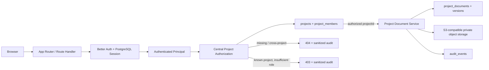
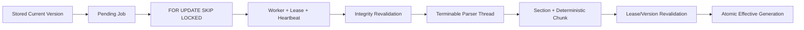
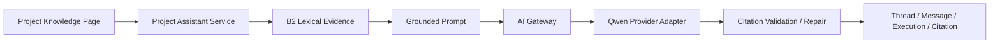
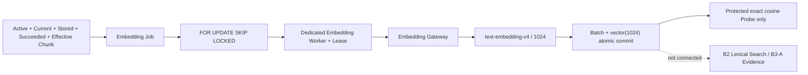

# Architecture

## v0.7 请求、身份、文件、知识、项目助手与向量基础边界



身份、角色、`projectId`、`documentId` 和 `versionId` 均不可信。受保护页面和 Route Handler 从数据库 Session 恢复用户，再由集中授权层查询项目成员关系。文件服务继续验证 `project → document → version` 复合归属；不存在和跨项目资源统一 404，只有已经确认项目可见但写角色不足时返回 403。`system_admin` 绕过项目成员关系只存在于集中授权层。

项目资料、项目知识搜索和项目助手均不再走 `data/mock`：列表、版本、current、归档、下载、处理状态、词法命中、AI Thread/Message/Execution/Citation 来自 PostgreSQL 与私有对象存储边界。需求、Scope、Action、会议和风险仍是授权后按精确 `projectId` 过滤的 Mock。

## PostgreSQL 与对象存储职责

| 存储 | 责任 | 明确不保存 |
| --- | --- | --- |
| PostgreSQL | 身份、Session、项目/成员；逻辑资料；版本元数据；解析 Job/Lease；Section/Chunk；词法索引；状态/current/effective；审计 | 原始文件正文、对象存储 Secret、完整 Provider 响应 |
| S3-compatible Object Storage | 不可变文件正文和 `sha256` object metadata | 用户角色、项目授权、current/归档业务状态 |

数据库是业务状态事实来源，但不能单独证明对象存在；对象存储也不能决定访问权限。任何读取先授权并查询数据库，再以内置 Object Key 访问对象。客户端 DTO 永不包含 Bucket、Endpoint、Object Key、Access Key 或 Secret。

## PostgreSQL 模型

| 表 | 责任与关键约束 |
| --- | --- |
| `users` | 唯一规范化 email、系统角色、active/disabled；不保存密码 |
| `accounts` | Better Auth credential；安全哈希只位于 `accounts.password_hash` |
| `sessions` | 数据库 Session、到期/创建/last seen；token 唯一 |
| `verifications` / `rate_limits` | Better Auth 兼容状态与数据库登录限流 |
| `projects` | 项目基础信息及同项目成员/文件写操作的事务锁边界 |
| `project_members` | `(project_id, user_id)` 唯一、项目角色 enum；最后 Manager 约束由事务服务执行 |
| `project_documents` | 逻辑资料、项目、display name、`pending/active/archived/failed`、创建/归档元数据；项目删除 `restrict` |
| `project_document_versions` | 不可变版本、project/document 复合外键、版本号、current、upload/object 唯一标识、文件元数据、`pending/stored/failed/quarantined/deleted` |
| `document_ingestion_jobs` | project/document/version/Generation、Parser/Chunker Version、状态、Attempt、Lease、Heartbeat 与脱敏失败 |
| `document_sections` | 文件自然结构与 PDF Page、DOCX Paragraph、XLSX Range、PPTX Slide、文本行 Source Locator |
| `document_chunks` | 确定性分块、内容 Hash、generated `tsvector`、`pg_trgm` 搜索字段和 `is_effective` |
| `ai_embedding_profiles` | 服务端只读 Embedding Profile；Provider/Model/Region/Dimensions/Distance/Profile Version，不保存 Secret |
| `document_embedding_jobs` | project/document/version/Profile/Generation、Attempt、Lease、Heartbeat、Usage、Latency 与受控失败 |
| `document_embedding_batches` | 每次最多 10 条的 Provider Batch、模型/维度、Usage、Latency、失败码和不估算的成本字段 |
| `document_embedding_provider_calls` | Batch 下逐次不可变 Call Attempt；dispatch 分类、硬预算规则/预留、Usage、Latency、请求 ID 与 succeeded/confirmed-no-charge/unknown 终态 |
| `document_chunk_embeddings` | 与 Chunk 内容 Hash 和复合项目范围绑定的 `vector(1024)`；只允许 current/invalid，不进入普通浏览器 API |
| `ai_model_profiles` | 服务端只读 Profile、Provider/Primary/Fallback/Region/Gateway Version；不保存 Secret 或 Base URL |
| `ai_threads` / `ai_messages` | 项目和创建者私有 Thread；用户/助手业务消息与状态，不保存 System Prompt |
| `ai_executions` | 幂等、阶段状态、Profile/模型/Fallback、Token Usage、Latency、问题 Hash 与受控失败码 |
| `ai_message_citations` | 服务端来源快照，以复合外键绑定同项目 Message 与 B2 Chunk |
| `audit_events` | actor、project、event/entity/result、脱敏 metadata、请求上下文与时间 |

文件版本约束包括：

- `(document_id, version_number)`、`upload_id`、`object_key` 唯一。
- Partial Unique Index：`unique(document_id) where is_current = true`。
- current 必须是 stored；stored 必须有 ETag/storedAt 且没有 failure code。
- pending 不得有 ETag/storedAt/current；failed/quarantined 必须有受控 failure code 且不得 current。
- `documentId + projectId` 复合外键和版本查询共同防止跨项目资源拼接。

数据库访问集中在 `lib/db/repositories/` 和领域服务中，页面组件不写 SQL。Migration 提交在 `drizzle/` 并只通过 `npm run db:migrate` 前向执行；Staging/Production 禁止 schema push。

## Object Key、文件验证与下载

Object Key 由服务端生成：

```text
projects/{projectId}/documents/{documentId}/versions/{versionId}/{randomUuid}
```

四个动态段只允许受控 ID 字符；Key 不使用原文件名、邮箱、客户/项目名称、路径、Session 或客户端随机片段。原文件名经 NFKC、basename、控制/bidi/非字符和 UTF-8 长度清理，仅作为 PostgreSQL 元数据及安全 `Content-Disposition` 使用。

上传默认上限 50 MiB，允许 PDF、DOCX、XLSX、PPTX、TXT 和 Markdown。上传路径先做签名与容器验证；独立 Parser Worker 再做受限正文解析，拒绝 DTD/Entity、外部关系、宏和危险部件，不执行公式或网络访问。

下载在读取对象后、发送响应前核对数据库大小、ETag 和 SHA-256 object metadata；响应固定 `attachment`、`X-Content-Type-Options: nosniff` 与 `Cache-Control: private, no-store`。完整性异常统一为脱敏的 `STORAGE_UNAVAILABLE`，不返回内部 S3 错误。

## 上传状态机与补偿

```mermaid
stateDiagram-v2
  [*] --> Pending: "DB reservation + upload audit"
  Pending --> Stored: "Object put verified + DB finalize"
  Pending --> Failed: "Put/finalize failed; object deletion confirmed"
  Pending --> Quarantined: "Compensation deletion not confirmed"
  Failed --> Pending: "same idempotency key + identical file retry"
  Stored --> [*]
```



三段式流程：

1. 事务锁定项目和逻辑资料，使用 `projectId + actorUserId + UUID Idempotency-Key` 派生唯一 `upload_id`，创建 pending 版本。
2. 向全新 Object Key 写入验证后的字节并核对 size/SHA-256/ETag。
3. 再次锁定并事务性标记 stored、选择最高 stored 版本为 current、取消旧 current、激活资料并写审计。

对象 put 失败会尝试删除目标 Key并把版本置 failed；删除无法确认则 quarantined。对象成功但数据库 finalize 失败会再次补偿删除并记录 `FINALIZE_*` failure code。标记失败本身为 best effort；stale pending、缺失对象、metadata mismatch 和 orphan 由只读检查接管。新版本永远生成新 Key，不覆盖历史对象。

## 版本、current 与归档

- 新版本事务锁定 `project_documents` 行后计算下一个版本号，数据库唯一约束兜底并发重复。
- 只有 Manager/Admin 能切换 current；目标必须属于同一项目/文档并为 stored。锁 + Partial Unique Index 防止双 current。
- 归档/恢复只有 Manager/Admin 可执行。归档不删对象、不删版本、不改变 current，仅从默认 active 列表排除并禁止新增版本/current 切换。
- Member 可上传资料/版本，Viewer 只读；所有项目角色可下载其授权项目 stored 版本。

## 一致性与 reconciliation

`verifyFileStorage()` 同时遍历数据库与 `projects/` 对象前缀，报告：missing object、size/ETag/SHA metadata mismatch、multiple current、active without current、超过 15 分钟 pending 和 orphan。CLI 只输出计数，不输出 Object Key 或 Secret。

`storage:reconcile` 默认 dry-run。即使传入 `--apply`，仍要求非 Production、`ALLOW_STORAGE_RECONCILE_APPLY=1`、精确 `OBJECT_STORAGE_BUCKET_CONFIRM`、至少 300 秒 orphan 年龄；删除前再次查询数据库引用，只删除仍无引用的对象并写审计。数据库记录缺对象不会被脚本自动删除或伪造修复。

## 文档处理队列与有效索引



解析不在领取事务内执行。完成事务必须确认 Worker 仍持有 Lease，且版本仍属于相同项目/文档；只有 Active 文档的 Current/Stored 版本能激活 Chunk。新版本、current 切换、归档和恢复都通过同一领域服务更新有效性，页面不直接操作索引。

搜索 SQL 同时限制 `project_id`、文档状态、current、storage、Job status 和 `is_effective`，组合 FTS、contains 与 `pg_trgm`。返回 DTO 不含 Job Lease、Worker ID、Object Key、Bucket 或 Endpoint。

## AI 与知识稳定边界



`ProjectKnowledgeService` 与 `AIGateway` 保持稳定边界，页面只能提交 `modelProfileId`。B3-A 复用 B2 `Active + Current + Stored + Succeeded + Effective` 词法检索，Evidence 与 System Prompt 分区；模型标记由服务端验证并映射为公开 Citation。没有 Evidence 时不调用模型。

Qwen Chat Adapter 只在 Node 服务端使用 `/chat/completions`。B3-B1 另有 Provider-neutral Embedding Gateway，固定调用 `/embeddings`、`text-embedding-v4` 和 1024 维；返回数量、顺序、维度及有限数值均失败关闭。两条链路都使用 Secret File，不向浏览器暴露 Base URL、Authorization、Provider Payload、Prompt、正文或向量。

## Embedding 队列与检索隔离



Job 只为同一精确项目中 Active/Current/Stored/Succeeded/Effective 的非空 Chunk 创建。Profile Version、Chunk Hash 或显式安全回填可以产生新 Generation；同 Profile + Chunk + Hash 的 current 向量直接复用。Chunk 失效触发向量 invalid，恢复后由 Job 在不调用 Provider 的情况下重新激活同 Hash 向量。B3-B1 只允许受保护运维执行精确 cosine Probe，不建立 HNSW/IVFFlat，也不接入用户搜索或项目助手 Evidence。

## Staging 环境与备份

- Production：`/tool/projectai`、`/srv/projectai`、`project-ai-os`、`127.0.0.1:3100`；v0.7 B3-B1 不得修改、迁移、部署、增加 pgvector/Worker 或配置 Qwen Secret。
- Staging 应用/Worker/数据库：App、Document Worker、专用 Embedding Worker、PostgreSQL 17 + pgvector 0.8.1 与命名卷；只有 App 发布 `127.0.0.1:3101`。
- Staging MinIO：`project-ai-os-staging-minio`、卷 `projectai-staging-minio`、Bucket `projectai-staging-files`；仅连接 `projectai-staging-internal`，不发布 API/Console 端口，不允许匿名访问。
- `projectai-minio-init` 使用 root credential 幂等创建私有 Bucket 和受 `projects/*` 限制的应用用户；应用只得到 scoped app credential。root/app credential 必须不同并只存在于 `root:root 600` 环境文件。
- 两个 Worker 与 App 使用同一 immutable image、独立 command、心跳健康和优雅退出。Document Worker 只得到对象存储 scoped credential；Embedding Worker 只得到数据库与 Qwen Secret，不得到对象存储 credential。

部署在 Migration 前同时停止 Staging App 与两个 Worker，创建 PostgreSQL custom dump 与 MinIO inventory/mirror。新代码必须先以 `AI_EMBEDDING_ENABLED=false` 在旧 Schema 上健康运行，再只执行新增 `0006_closed_genesis.sql`，验证 `pg_trgm`、pgvector 0.8.1、`vector(1024)`、Profile、不可变 Provider Call 与 Worker heartbeat Schema，之后才允许 Probe、分阶段启用、虚构 Smoke、B3-A 回归与清理。

Embedding Provider 调用使用数据库先行状态机：Batch 保持 `(job_id, request_sha256)` 唯一，每次真实尝试新增 Call Attempt。调用前事务校验 Job Lease，并按 `min(itemCount × 8192, 33000)` 与版本化规则取得 UTC 日预算锁、写入 `reserved`；进入 `fetch` 前持久化 `calling`。成功结果、向量、Usage、Batch 与 Call 在同一事务提交。已发送但无法确认的 Timeout、网络、HTTP 拒绝、2xx 解析/校验、提交窗口或 stale call 都终止为不可变 `unknown` 并保留预留；只有发送前 confirmed-no-charge 终态释放预算并允许普通重试。人工接受潜在重复计费时保留旧 Unknown Call，另建新 Call 与预算。

`unknown` 继续占用调用当日的预留预算。人工确认可能重复计费后，先运行 `npm run embeddings:retry-unknown -- --job=<id> --accept-possible-duplicate-charge` 查看 dry-run；只有再加 `--apply` 才会重新入队。该命令不输出正文、向量、Provider Payload 或 Secret。

## CI 与产品审查证据边界

CI 使用 `pgvector/pgvector:0.8.1-pg17` 和运行时创建的 MinIO；Embedding 测试只在 `NODE_ENV=test` 使用 Fake Provider。CI 不连接 Qwen、Staging/Production 或远程 Bucket。

产品 Evidence 采用强 allowlist。Payload A 只可包含：

- `evidence-index.json`、`sanitization-report.json`。
- 30 张约定 PNG 截图（原有 12 张 + 10 张解析/搜索截图 + 8 张项目助手截图），每张记录实际宽高。
- 固定名称的 UTF-8 纯文本测试日志。

`playwright-report/`、`test-results/`、trace/video、任意归档/PDF、上传测试原件、数据库/对象备份和未列名文件均不进入 Payload A。sanitizer 对数据库/认证/MinIO/object-storage/Qwen Secret、Qwen Base URL、Bucket/Endpoint/Object Key、Cookie/Session、System Prompt、Provider Request/Response 和编码变体做删除/脱敏并失败关闭。

GitHub Actions 仍先上传不可变 Payload A，再用返回的真实 artifact ID/digest 生成 Provenance B。Manifest schema v3 记录 Worker/Parser/Chunker/AI Gateway Version、Assistant Profile 和 PNG 实际尺寸。`MVP_STATUS.md` 只记录稳定交付结论；最终 Head、CI、Artifact 与 Staging 动态精确事实只进入 Draft PR、Provenance Manifest 和受控部署证据。
