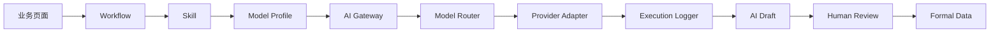
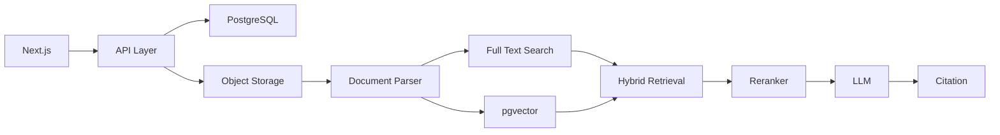

# Architecture

## 当前 AI 业务链路

页面只依赖 Workflow、Skill、`AIGateway` 和 `ProjectKnowledgeService` 契约，不得感知具体 Provider 或模型名称。

## 未来真实架构

## 稳定边界

- `ProjectKnowledgeService` 保持接口不变；Mock 将来由权限过滤、混合检索和引用服务替换。
- `AIGateway` 保持接口不变；Mock Provider 将来由真实 Provider Adapter 替换。
- Skill 只保存 `modelProfileId`，不保存供应商模型名。
- 所有调用写 execution log；API Key 只存在服务端。
- 正式数据、AI 生成记录、审核版本和审计记录分表/分存储模型保存。

## 环境与部署

- Production：`/tool/projectai`、`/srv/projectai`、`project-ai-os`、`127.0.0.1:3100`。
- Staging：`/tool/projectai-staging`、`/srv/projectai-staging`、`project-ai-os-staging`、`127.0.0.1:3101`。
- 两套环境共享代码契约，不共享容器、端口、部署目录或 localStorage 命名空间。
- vinext standalone 的浏览器资源 URL 带 basePath，上游资源目录为 `/assets/`，由窄范围 Nginx location 适配。
