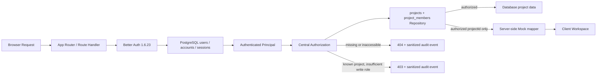
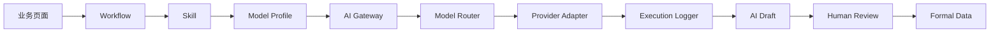
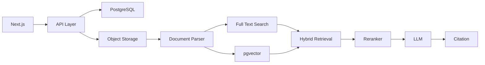

# Architecture

## v0.3 请求与数据边界

身份与项目访问不是客户端状态：每个受保护页面和 Route Handler 都从数据库 Session 恢复用户，再由集中授权层查询 PostgreSQL 项目/成员关系。`system_admin` 的全项目能力只在该层集中处理。

同一项目的成员写操作使用 `projects` 行作为 PostgreSQL 事务互斥锁。固定顺序为 project `FOR UPDATE` → 锁后重新授权 → target membership `FOR UPDATE` → 最后 Manager guard → mutation/audit；因此普通 Manager 和 `system_admin` 都不能把项目降到零 `project_manager`，两个并发降级或删除也不能产生 write skew。拒绝操作不在事务内抛错，而是提交脱敏审计后由 Route Handler 返回精确 409。

项目详情中的文档、引用、需求、Scope、Action、会议、风险和 AI execution 仍为 Mock。Catch-all Server Component 必须先调用 `requireProjectAccess(projectId)`，成功后才允许 `getAuthorizedMockProjectPayload(authorizedProject.id)` 精确过滤并序列化；工作台级项目数组由当前用户已授权项目 ID 集合在服务端过滤。客户端没有“收到全部数据再隐藏”的权限职责。

## PostgreSQL 模型

| 表 | 责任与关键约束 |
| --- | --- |
| `users` | 规范化唯一 email、display name、系统角色、active/disabled、时间戳；不保存密码字段 |
| `accounts` | Better Auth credential identity；安全哈希只位于 `accounts.password_hash`，provider/account 唯一；`users` 不复制 hash |
| `sessions` | Better Auth token、user、过期时间、创建时间、last seen、基础请求信息；token 唯一 |
| `verifications` / `rate_limits` | Better Auth 兼容表与数据库登录限流 |
| `projects` | 项目基础信息、状态、阶段、健康、目标上线日、创建者与时间戳 |
| `project_members` | 项目角色、创建者；`(project_id, user_id)` 唯一，角色由 PostgreSQL enum 约束 |
| `audit_events` | actor、project、event/entity/result、脱敏 metadata、IP、User Agent、时间 |

数据库访问集中在 `lib/db/repositories/`，页面组件不写 SQL。Migration 由 `drizzle/` 提交并通过 `npm run db:migrate` 执行；Staging/Production 禁止 destructive schema push。

当前持久化事件包括 `login_succeeded`、`login_failed`、`logout`、`project_created`、`project_viewed`、`project_access_denied`、`project_member_added`、`project_member_role_changed` 和 `project_member_removed`。只允许 `system_admin` 通过只读 API 查询最近事件；普通用户不能读取审计列表。

## 当前 AI 业务链路

页面只依赖 Workflow、Skill、`AIGateway` 和 `ProjectKnowledgeService` 契约，不得感知具体 Provider 或模型名称。

该 AI 链路在 v0.3 仍由 Mock Provider 和服务器授权后的 Mock 项目数据驱动，没有真实模型、文件解析、Embedding 或 RAG。

## 下一阶段候选真实架构（未实现）

## 稳定边界

- `ProjectKnowledgeService` 保持接口不变；Mock 将来由权限过滤、混合检索和引用服务替换。
- `AIGateway` 保持接口不变；Mock Provider 将来由真实 Provider Adapter 替换。
- Skill 只保存 `modelProfileId`，不保存供应商模型名。
- 所有调用写 execution log；API Key 只存在服务端。
- 正式数据、AI 生成记录、审核版本和审计记录分表/分存储模型保存。
- `requireAuthenticatedUser`、`requireSystemAdmin`、`requireProjectAccess`、`requireProjectRole`、`canReadProject`、`canEditProject` 与 `canManageProjectMembers` 是身份/项目边界；任何未来 Repository/检索服务也必须复用该边界。

## 环境与部署

- Production：`/tool/projectai`、`/srv/projectai`、`project-ai-os`、`127.0.0.1:3100`。
- Staging：`/tool/projectai-staging`、`/srv/projectai-staging`、`project-ai-os-staging`、`project-ai-os-staging-postgres`、`projectai-staging-postgres`、`127.0.0.1:3101`。
- Staging PostgreSQL 只在 `projectai-staging-internal` Docker 网络中提供 `5432`，不发布宿主机端口；应用在数据库 Healthy 后启动，Migration/Seed 由短生命周期 operations 容器受控执行。
- Compose 不把完整 `.env.auth-staging` 注入所有容器：PostgreSQL 只接收 `POSTGRES_DB` / `POSTGRES_USER` / `POSTGRES_PASSWORD`，operations 容器按 Migration/Seed 需要接收数据库、认证和 Seed 变量，应用只接收运行所需的 `DATABASE_URL`、Better Auth/Cookie 配置与公开构建元数据，不接收 Seed 密码或 `POSTGRES_PASSWORD`。
- 应用健康检查调用 `${basePath}/api/health`；只有 PostgreSQL 认证/查询成功且 `users`、`sessions`、`projects`、`project_members` 四张已提交核心表可查询时才返回 `status: ok`，失败只返回通用 `503`，不泄露计数、Schema 或连接信息。健康响应仅在运行环境提供完整合法 Commit 时附加非敏感的 `x-projectai-commit-sha` 响应头；CI 必须同时验证 HTTPS 请求成功、body 为 `status: ok` 且该头为完整 SHA，才可把它记为实际观测的 `stagingSha`。
- 发布只使用当前 Commit 的 tracked-file archive，并以 Staging 专属原子锁串行化；远端 Secret、备份、锁与事务标记不进入镜像 context。已有 PostgreSQL 数据挂载必须严格匹配固定命名卷。
- 每次 Staging Migration 前检查空间并流式创建、原子完成 root-only custom-format `pg_dump`，保留最近 10 份。部署在替换应用前记录上一镜像并提前创建事务标记；替换后的任一验收失败会自动恢复上一应用镜像，数据库卷和备份保持不动。数据库 schema 的不兼容回退仍必须在维护窗口人工审核后执行。
- Staging 应用、PostgreSQL 和 operations 容器都有 CPU、内存、PID 与滚动日志上限，避免共享主机资源失控影响 Production。
- 两套环境共享代码契约，不共享应用/数据库容器、端口、部署目录、数据库、认证 URL、Cookie 前缀/路径或 localStorage 命名空间。
- vinext standalone 的浏览器资源 URL 带 basePath，上游资源目录为 `/assets/`，由窄范围 Nginx location 适配。
- v0.3 只允许部署 Staging，Production Compose、环境变量、数据库和容器均不得修改。

## CI 产品审查证据边界

测试生成的 `playwright-report/`、`review-artifacts/`、`test-results/` 和 `test-logs/` 是 CI 工作区内的原始输入，不直接上传。`review-artifacts/evidence-index.json` 是预上传索引：它拆分 `headSha`、`testedMergeSha`、`stagingSha`，并记录 `branch`、`workflowRunId`、`version`、`buildTime`、运行状态和截图合同；它既不包含上传前未知的 `artifactId`，也不允许含义模糊的 legacy `commit`。

所有输入先复制到 `product-review-evidence/`，结合运行时环境 Secret 与必须可查询的数据库 Session Token 做精确值扫描；所有文本执行结构化 Session/Cookie 清理，改名、嵌套或 SFX ZIP 与 gzip 由 magic 识别，归档 entry 路径一并清理，ZIP Data URI 支持 MIME、大小写、空白、Base64 和原始 percent-encoding 变体。Secret 集合同时覆盖 URL、JSON、标准/URL-safe/折行 Base64 与组合编码。归档递归解包、脱敏、复核并重建；无法保证安全的二进制/普通归档即使已删除或替换为 omission 说明，也会让整个步骤失败。数据库 Session 不可核验、内嵌归档无法解析、evidence index 自相矛盾或 legacy provenance 存在时同样失败关闭。成功运行必须有 6 张必需截图；失败/取消运行允许 index 明确列出缺失截图并上传已安全清洗的日志。最终树与合同复核通过后才写入 `sanitization-report.json`。

GitHub Actions 随后执行不可颠倒的两阶段发布：先上传脱敏 Payload A `product-review-evidence-${workflowRunId}-${runAttempt}`；上传动作返回 A 的真实 `artifact-id` 与 digest 后，再从已脱敏 index 生成权威 `product-review-manifest/manifest.json`，并上传独立 Provenance B `product-review-manifest-${workflowRunId}-${runAttempt}`。B 的 `artifactId` 指向 A，digest 将 Manifest 与不可变 Payload 绑定；B 不尝试记录自身尚未分配的 ID。任一步骤失败都会阻止后续阶段。
