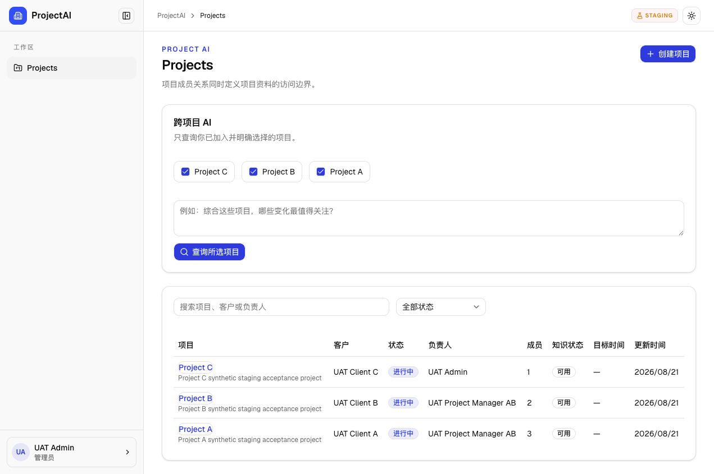
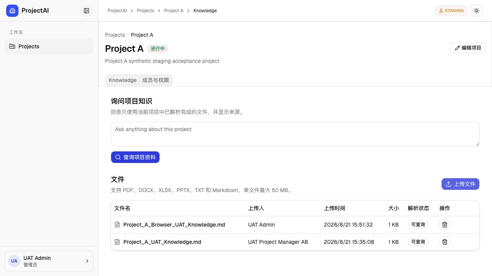
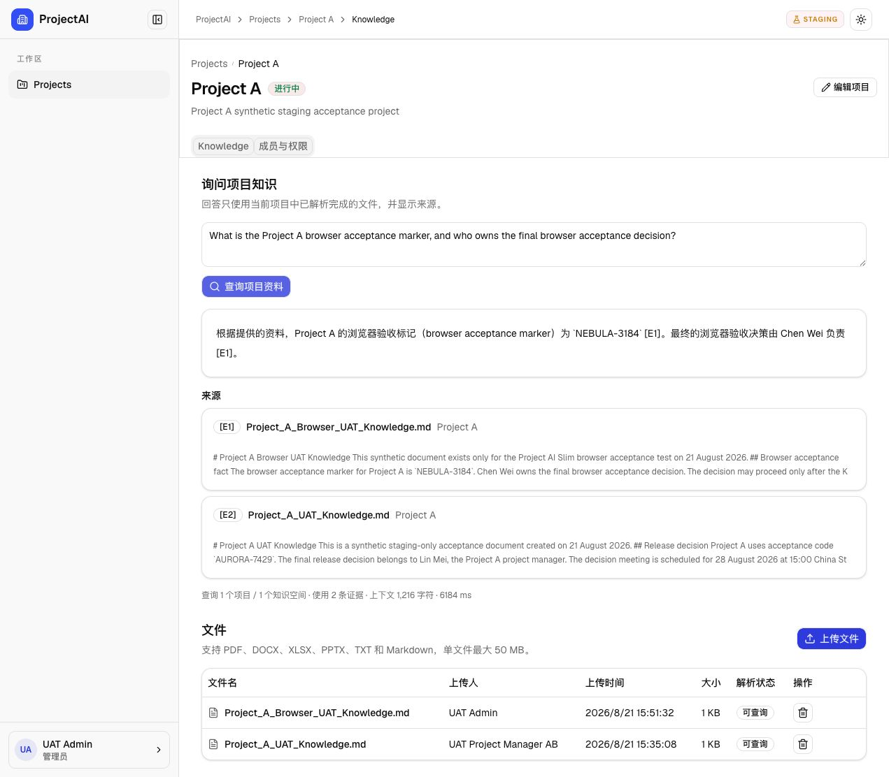

# Project AI Slim Staging UAT Evidence

Date: 2026-08-21
URL: https://gridworks.cn/tool/projectai-slim-uat/
Access mode: `REMOTE`
Runtime: standalone Node
Build: `uat-20260821T0745Z`

All uploaded files and questions used for this verification were synthetic. No customer content, password, Session token, API key, Provider payload, or private key is included in this evidence.

## Result

| Area | Result | Evidence |
| --- | --- | --- |
| Public HTTPS URL and health | PASS | Login page and `/api/health` returned HTTP 200 through Nginx. |
| Admin login default destination | PASS | `admin@test.local` reached `/projects` after login. |
| Session persistence | PASS | Refresh retained the authenticated Projects page. |
| Logout | PASS | Browser logout returned to `/login`; HTTP Session revocation also passed. |
| Admin project scope | PASS | Project A, Project B, Project C visible and accessible. |
| `pm-a` isolation | PASS | Only Project A listed; direct Project B and Project C API requests returned 404. |
| `pm-ab` isolation | PASS | Project A and Project B listed; direct Project C API request returned 404. |
| RAGFlow dataset mapping | PASS | Independent live datasets provisioned for Project A, B, and C. |
| Browser upload | PASS | Synthetic Markdown uploaded from the Project A Knowledge page. |
| RAGFlow parse | PASS | Status changed from `解析中` to `可查询`. |
| Real grounded answer | PASS | Qwen answered the synthetic `NEBULA-3184` question with `Chen Wei`. |
| Citation | PASS | `[E1]` pointed to `Project_A_Browser_UAT_Knowledge.md` in Project A. |
| Database isolation | PASS | UAT PostgreSQL has no published host port. |
| Production invariance | PASS | Existing Production and legacy Staging containers remained healthy with restart count 0. |

## Browser evidence

### 1. Admin Projects and A/B/C visibility

### 2. Browser upload parsed and ready

### 3. Real answer and Citation

## Verification commands

- Remote HTTPS Auth and authorization verifier: PASS for all three accounts.
- Live RAGFlow upload, parse, grounded answer, and Citation verifier: PASS.
- `npm test`: 25/25 PASS (18 unit + 7 rendered/proxy checks).
- `npm run typecheck`: PASS.
- `npm run lint`: PASS.
- `git diff --check`: PASS.

Temporary passwords are not stored in this document and are provided separately.
