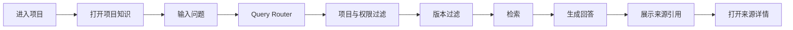
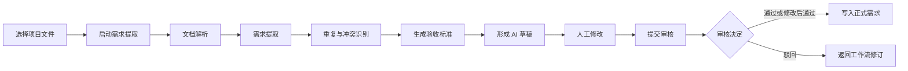
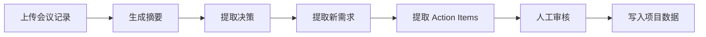

# User Flows

## 项目知识问答

验收重点：请求必须绑定 projectId；只使用当前有效知识；回答包含文件、章节、页码或片段；来源可以打开；无权限时不得泄露任何片段。

## 需求提取与审核

验收重点：AI 输出始终是草稿；Failure 可重试；原始结果、修改差异、审核备注和 executionId 可追溯；只有人工通过后才能触发正式写入。

## 会议到 Action Plan（目标流程，当前 Mock）

当前只展示 Mock 会议、决策和 Action 数据，不接受真实会议记录。
