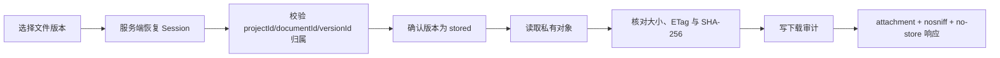
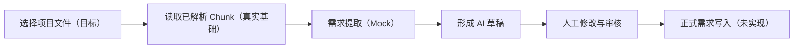

# User Flows

## 项目资料上传、版本与处理（v0.5 真实流程）

页面必须具备 Empty、Loading、Error、Retry、上传进度、成功/失败反馈、active/archived 列表、版本历史、current 标识与权限禁用状态。上传请求携带 UUID `Idempotency-Key`；相同用户/项目/key 重试不得重复创建版本或对象。

第一次上传创建逻辑资料和 version 1。新版本锁定同一逻辑资料并使用新的 Object Key；成功后成为 current，历史版本仍可下载且不被覆盖。Manager 或 system admin 可以把任一 `stored` 历史版本重新设为 current；Member 和 Viewer 不可切换。

上传失败时页面可重试，但失败版本保持可审计状态。对象写入失败或数据库最终确认失败都会尝试补偿删除；无法确认删除时由只读一致性检查报告，不在请求中暴露对象存储错误。

资料页显示等待解析、正在解析、索引成功、解析失败和需要 OCR。Manager/Admin 可重新解析；任何处理失败都不影响原文件下载，也不会产生有效半成品索引。

## 下载（v0.5 真实流程）

所有项目角色都可下载其授权项目的 stored 版本。跨项目或被篡改的资源 ID 统一 404；浏览器永远看不到 Bucket、Endpoint、Object Key 或凭据。归档资料仍保留历史和授权下载能力，但不出现在默认 active 列表。

## 归档与恢复（v0.5 真实流程）

只有 `project_manager` 和 `system_admin` 可以归档/恢复。归档立即停用该资料的有效 Chunk，不删除版本对象；恢复后只激活 current 版本已有的成功索引，否则创建新 Job。

| 角色 | 查看/下载/搜索 | 上传资料/版本 | reindex | 切换 current | 归档/恢复 |
| --- | --- | --- | --- | --- |
| System Admin | 是 | 是 | 是 | 是 | 是 |
| Project Manager | 是 | 是 | 是 | 是 | 是 |
| Project Member | 是 | 是 | 否 | 否 | 否 |
| Viewer | 是 | 否 | 否 | 否 | 否 |

## 项目知识搜索（v0.5 真实流程）

项目知识页读取真实文件的当前有效词法索引，只返回原始片段和来源，不生成 AI 综合答案。

PDF 显示页码，DOCX 显示标题路径/段落，XLSX 显示 Sheet/行列，PPTX 显示 Slide，TXT/Markdown 显示行号或标题。页面必须明确声明“尚未启用 AI 综合回答”。

## 需求提取与审核（目标流程，当前 Mock）

v0.5 B2 不会把真实上传文件交给 Mock AI，也不实现 RAG、真实模型或正式需求数据层。已有审核交互仍只产生 Mock 状态反馈。

## 会议到 Action Plan（目标流程，当前 Mock）

会议、决策和 Action 数据仍为 Mock；本轮不接受会议文件进行解析，不自动摘要、提取 Action、识别风险或生成周报。
