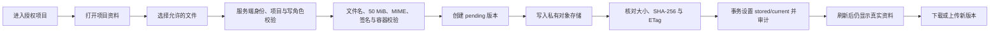
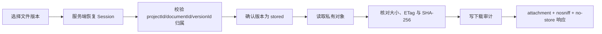
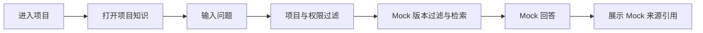
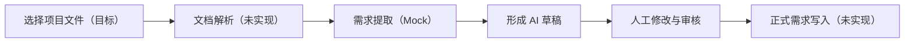

# User Flows

## 项目资料上传与版本管理（v0.4 真实流程）

页面必须具备 Empty、Loading、Error、Retry、上传进度、成功/失败反馈、active/archived 列表、版本历史、current 标识与权限禁用状态。上传请求携带 UUID `Idempotency-Key`；相同用户/项目/key 重试不得重复创建版本或对象。

第一次上传创建逻辑资料和 version 1。新版本锁定同一逻辑资料并使用新的 Object Key；成功后成为 current，历史版本仍可下载且不被覆盖。Manager 或 system admin 可以把任一 `stored` 历史版本重新设为 current；Member 和 Viewer 不可切换。

上传失败时页面可重试，但失败版本保持可审计状态。对象写入失败或数据库最终确认失败都会尝试补偿删除；无法确认删除时由只读一致性检查报告，不在请求中暴露对象存储错误。

## 下载（v0.4 真实流程）

所有项目角色都可下载其授权项目的 stored 版本。跨项目或被篡改的资源 ID 统一 404；浏览器永远看不到 Bucket、Endpoint、Object Key 或凭据。归档资料仍保留历史和授权下载能力，但不出现在默认 active 列表。

## 归档与恢复（v0.4 真实流程）

只有 `project_manager` 和 `system_admin` 可以归档/恢复。归档只改变逻辑资料状态，不删除任何版本对象，不允许未来知识索引把它当作当前有效资料；恢复后继续使用归档前的 current 版本。`project_member` 和 `viewer` 的直接写 API 请求必须由服务端拒绝。

| 角色 | 查看/下载 | 上传资料/版本 | 切换 current | 归档/恢复 |
| --- | --- | --- | --- | --- |
| System Admin | 是 | 是 | 是 | 是 |
| Project Manager | 是 | 是 | 是 | 是 |
| Project Member | 是 | 是 | 否 | 否 |
| Viewer | 是 | 否 | 否 | 否 |

## 项目知识问答（目标流程，当前仍为 Mock）

真实上传文件尚未解析、分块或建立索引。知识页继续只使用服务端授权后按 `projectId` 精确过滤的 Mock 知识与引用，不能读取 v0.4 对象存储正文。

页面必须明确区分“文件已真实存储”和“文档解析与 AI 知识索引尚未启用”。SEC-008 仍只能是部分完成。

## 需求提取与审核（目标流程，当前 Mock）

v0.4 不会把真实上传文件交给 Mock AI，也不实现解析、RAG、真实模型或正式需求数据层。已有审核交互仍只产生 Mock 状态反馈。

## 会议到 Action Plan（目标流程，当前 Mock）

会议、决策和 Action 数据仍为 Mock；本轮不接受会议文件进行解析，不自动摘要、提取 Action、识别风险或生成周报。
