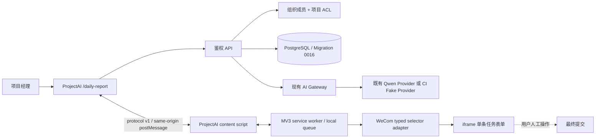

# 项目经理日报 MVP 架构

## 范围与稳定边界

本能力由两个解耦模块组成：ProjectAI Web/后端负责事实记录、AI 草稿、人工审核、所有权、审计与同步批次；Chrome MV3 扩展负责在用户已登录的企业微信页面逐条填写。两者只通过版本化 JSON 与严格的 `window.postMessage` 消息通信。

Feature Flag `PM_DAILY_REPORT_ENABLED` 和 `WECOM_TIMESHEET_SYNC_ENABLED` 默认关闭。API、服务和 UI 都校验 Flag；隐藏导航不是安全边界。Production 未自动启用，也未因本功能执行任何部署或数据操作。



## 事实与信任边界

- 浏览器 Session 只由现有 Better Auth `HttpOnly` Cookie 建立。
- 所有日报查询同时绑定 `organizationId` 和 Session 用户；资源不属于当前用户时统一返回 404。
- 项目下拉来自服务端授权 Viewer；创建记录、审核、确认和同步时再次校验项目访问权。
- AI 只接收当前用户、当前组织、当前日期的有效随记，当前用户可访问的项目与正式 Action；会议来源目前为空数组。
- AI 输出经严格 Zod Schema 和事实校验，只写 `needs_review` 草稿。用户填写全部必填字段并标记审核后才能确认。
- 同步批次只来自已确认且版本匹配的草稿；扩展进度写回时后端验证批次创建者、逐项归属和终态一致性。
- 扩展不包含模型调用、账号、Cookie、Token、最终提交 Selector 或跨域后端凭据。

## 状态流

```text
随记 → AI execution(running/succeeded/failed)
     → needs_review → 用户编辑/审核 → confirmed
     → sync batch(pending/running/paused)
     → synced | partially_synced | failed | cancelled
```

草稿使用单调递增 `version` 做乐观锁。随记变更会使尚无同步历史的确认草稿回到 `needs_review`。已有同步历史的草稿不能重写或重新生成。AI 并发由 PostgreSQL advisory lock 与“每用户/日期仅一个 running execution”的部分唯一索引限制；超时 execution 被受控标记为 `AI_EXECUTION_STALE` 后才允许重试。

扩展按 `sync_batch_id + task.id` 幂等。`saved` 永不回退；`failed` 仅用户主动继续时重试；`unknown` 与 Service Worker 中断后的 `running` 会暂停，绝不自动重放。用户在企业微信人工核对后，可在 Popup 二次确认其“已保存”或“未保存”；前者永久跳过，后者转为 failed 后仍需主动继续。

## 失败与恢复

- Provider 缺失或失败：随记仍可编辑，生成返回受控错误，不生成伪草稿。
- 模型输出非法：允许一次受控修复；再次失败则 execution 失败。
- ProjectAI/扩展未连接：确认、复制和下载仍可用，同步按钮禁用。
- 未登录或登录过期：当前项进入 `waiting_for_login`，用户手动登录后主动继续。
- DOM/Selector/唯一匹配失败：当前项失败或未知，批次暂停。
- 保存结果不确定：记录 `unknown`，必须人工确认企业微信页面后再处理。

## 已知限制

- 尚未获得真实 `WECOM_TASK_BOARD_URL`、真实 DOM、iframe 与控件演示，因此没有提交正式 Selector Config，也未做真实企业微信验收。
- 会议输入当前为空数组；不伪造会议。
- 扩展发布包是评审构建，未绑定真实企业微信 Origin，不可用于真实页面同步。
- MVP 不自动填写或点击最外层最终提交，不做主管汇总、跨用户日报查看、语音识别或后台定时生成。
